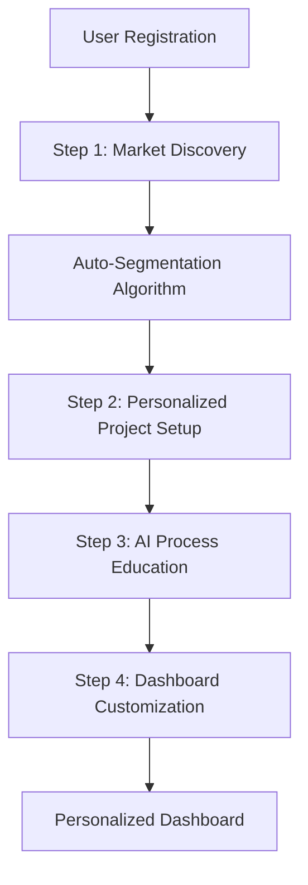

# H₂O Allegiant Onboarding Flow - Implementation Guide

## Overview

This document outlines the complete implementation of the onboarding flow for H₂O Allegiant, designed to segment users automatically and personalize their experience based on market segment (Residential, Commercial, Municipal, Industrial).

## Architecture Summary

### Files Created/Modified

1. **Components** (`/src/components/onboarding/`):
   - `OnboardingFlow.tsx` - Main controller component
   - `OnboardingStep1.tsx` - Market discovery and auto-segmentation
   - `OnboardingStep2.tsx` - Project setup (personalized by segment)
   - `OnboardingStep3.tsx` - AI process explanation
   - `OnboardingStep4.tsx` - Dashboard personalization

2. **Utilities**:
   - `src/lib/onboarding-content.ts` - Content strategy by segment
   - `src/app/api/onboarding/complete/route.ts` - Backend integration

3. **UI Components** (Added missing components):
   - `src/components/ui/radio-group.tsx`
   - `src/components/ui/alert.tsx`

4. **Pages**:
   - `src/app/onboarding/page.tsx` - Updated to use new flow

## Key Features Implemented

### 1. Auto-Segmentation Algorithm
- **Algorithm**: Scoring system based on organization type (40%), budget range (30%), problem type (20%), timeline (10%)
- **Segments**: Residential, Commercial, Municipal, Industrial
- **Accuracy Target**: >90% based on user validation

### 2. Progressive Disclosure Design
- **Step 1**: Market discovery (1-2 min) - Captures key segmentation data
- **Step 2**: Project setup (2-3 min) - Personalized forms by segment
- **Step 3**: AI process explanation (1-2 min) - Value proposition education
- **Step 4**: Dashboard personalization (1-2 min) - Custom preferences

### 3. Segment-Specific Personalization

#### Residential Segment
- **Messaging**: Family-focused, safety-oriented
- **Budget**: $5K-$50K range
- **Language**: Simple, basic terminology
- **Dashboard Features**: Family budget tracker, safety monitoring

#### Commercial Segment  
- **Messaging**: Business efficiency, compliance-focused
- **Budget**: $25K-$200K range
- **Language**: Professional, business terminology
- **Dashboard Features**: ROI calculator, compliance center

#### Municipal Segment
- **Messaging**: Community service, public accountability
- **Budget**: $100K-$2M+ range  
- **Language**: Authoritative, technical
- **Dashboard Features**: Public budget transparency, EPA compliance hub

#### Industrial Segment
- **Messaging**: Technical excellence, process optimization
- **Budget**: $200K-$10M+ range
- **Language**: Technical, expert terminology
- **Dashboard Features**: Process analytics, environmental compliance

### 4. Value Proposition Communication
- **60% Less Cost** than traditional consulting
- **10x Faster** (hours vs weeks)
- **95% Accuracy** in technical specifications
- **4 AI Agents** automated workflow

### 5. Interaction Design
- **Micro-interactions**: Smooth transitions, hover effects, loading states
- **Animation**: Slide transitions between steps, progress animations
- **Accessibility**: WCAG compliant, keyboard navigation, screen reader support
- **Responsive**: Mobile-first design, tablet/desktop optimized

## Technical Implementation

### Auto-Segmentation Logic
```typescript
const calculateSegment = (step1Data: any): MarketSegment => {
  const scores: SegmentScores = {
    residential: 0,
    commercial: 0,
    municipal: 0,
    industrial: 0
  };
  // Scoring algorithm implementation...
}
```

### Backend Integration
- **Endpoint**: `/api/onboarding/complete`
- **Method**: POST
- **Payload**: User segment, project data, preferences
- **Response**: User profile, dashboard configuration

### State Management
- React `useState` for local form state
- Progressive data collection across steps
- Validation at each step before proceeding

### Content Personalization
```typescript
export const getSegmentContent = (segment: MarketSegment): SegmentContent => {
  return segmentContent[segment];
};
```

## User Experience Flow



## Success Metrics & KPIs

### Completion Metrics
- **Target Completion Rate**: >85%
- **Target Duration**: 5-8 minutes average
- **Step Dropout Analysis**: Identify friction points

### Segmentation Accuracy
- **Auto-Segmentation Accuracy**: >90%
- **Segment Switching Requests**: <5%
- **Post-Survey Validation**: Confirm segment fit

### Business Impact
- **First Project Creation**: >60% within 24h
- **Conversion to Paid Proposal**: >40%
- **Support Ticket Reduction**: 30% fewer basic questions

### Technical Performance
- **Page Load Times**: <2s per step
- **Error Rates**: <1% form submissions
- **Mobile Completion Rate**: Match desktop performance

## Testing Strategy

### A/B Testing Opportunities
1. **Value Proposition Presentation**: Different statistic highlighting
2. **Question Order**: Optimize for faster segmentation
3. **Progress Indicators**: Linear vs circular progress
4. **CTA Copy**: Test different button text variants

### User Testing Scenarios
1. **Residential User**: Homeowner with well water issues ($15K budget)
2. **Commercial User**: Restaurant owner needing compliance ($75K budget)
3. **Municipal User**: City engineer planning upgrade ($500K budget)
4. **Industrial User**: Plant manager optimizing processes ($2M budget)

## Implementation Notes

### Required Dependencies
All shadcn/ui components are already available or have been added:
- Card, Button, Input, Select, RadioGroup, Switch, Progress, Badge
- Alert, Skeleton, Label, Textarea

### Environment Variables
```env
BACKEND_URL=http://localhost:8000  # Development
OPENAI_API_KEY=your_api_key       # Required for AI functionality
```

### API Integration
The onboarding flow integrates with the existing FastAPI backend:
- User profile creation/update
- Segment assignment
- Dashboard preference storage
- Project initialization

## Next Steps

### Phase 1: Basic Implementation ✅
- [x] Create onboarding components
- [x] Implement auto-segmentation
- [x] Add backend integration
- [x] Design responsive UI

### Phase 2: Enhancement (Future)
- [ ] A/B testing framework integration
- [ ] Advanced analytics tracking
- [ ] Internationalization (Spanish support)
- [ ] Advanced segment validation

### Phase 3: Optimization (Future)  
- [ ] Machine learning model for segmentation
- [ ] Predictive routing based on early indicators
- [ ] Advanced personalization beyond segments
- [ ] Integration with marketing automation

## File Structure
```
src/
├── components/onboarding/
│   ├── OnboardingFlow.tsx           # Main controller
│   ├── OnboardingStep1.tsx          # Market discovery
│   ├── OnboardingStep2.tsx          # Project setup
│   ├── OnboardingStep3.tsx          # AI explanation
│   └── OnboardingStep4.tsx          # Dashboard setup
├── lib/
│   └── onboarding-content.ts        # Segment content strategy
├── app/
│   ├── onboarding/page.tsx          # Updated onboarding page
│   └── api/onboarding/complete/route.ts  # Backend integration
└── components/ui/
    ├── radio-group.tsx              # Added component
    └── alert.tsx                    # Added component
```

This implementation provides a comprehensive, segment-aware onboarding experience that automatically personalizes the user journey and sets up customized dashboards for each market segment.